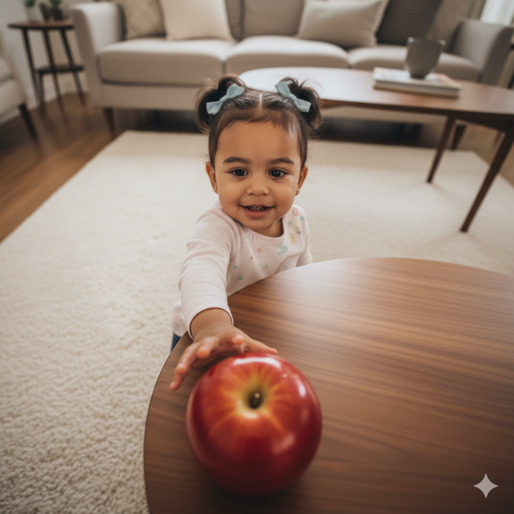
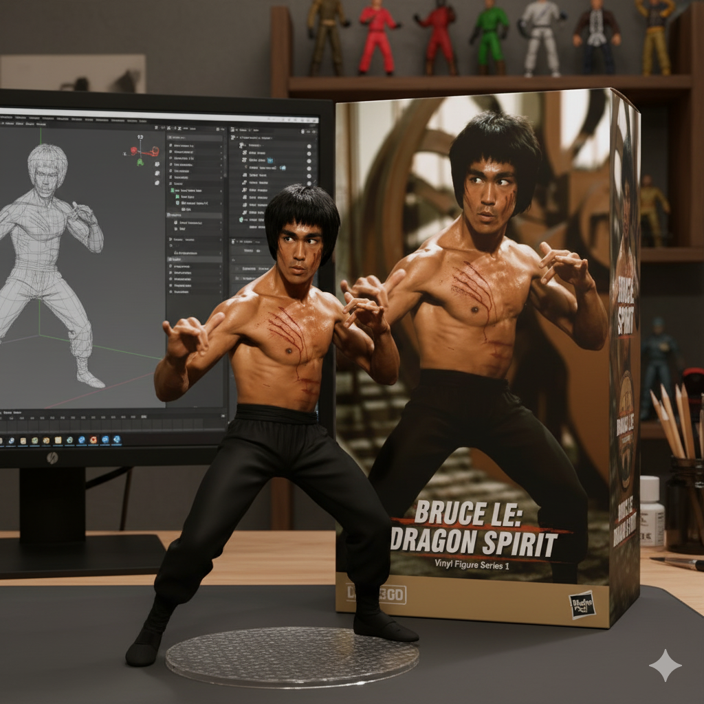
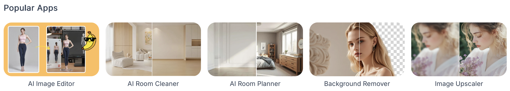
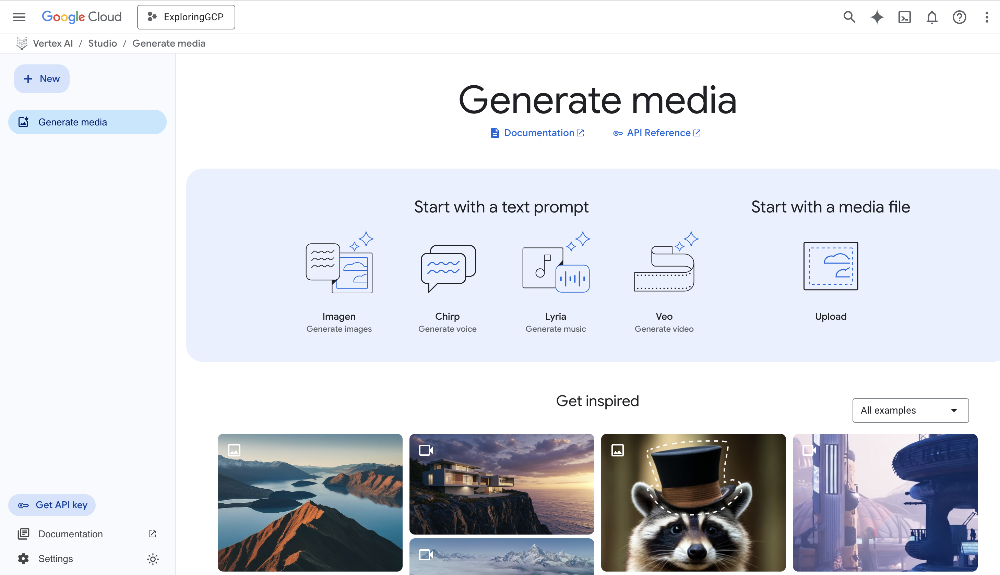
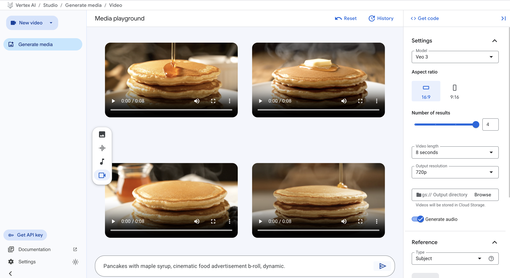
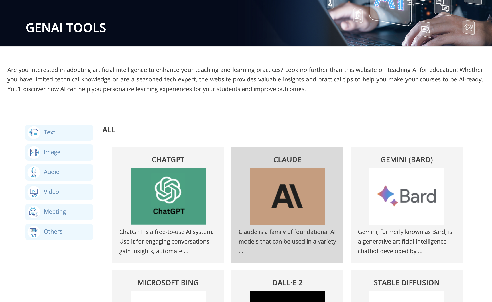

<link rel="stylesheet" href="./style.css">

# Welcome to Lead With AI

Rewiring How You Work by Mastering How AI Works and Leveraging Generative AI Tools.

# Hello! My Name is Sunny 🌞


**Founder / Master Trainer** at [Image Nation](https://www.imagenation.com.hk)  
**Part-time Lecturer** at HKU Business School, HKU School of Chinese, HKUSPACE  
**Email**: sunny.ng@imagenation.com.hk  
**Profile**: [Sunny Ng](https://training.imagenation.com.hk/#sunny-ng)

# Useful Keyboard Shortcuts for Today

| Keyboard Shortcut | Description                                          |
| ----------------- | ---------------------------------------------------- |
| `CTRL` + `C`      | Copy selected text                                   |
| `CTRL` + `V`      | Paste copied text                                    |
| `CTRL` + `Z`      | Undo last action                                     |
| `WIN` + `D`       | Show Windows Desktop                                 |
| `SHIFT` + `ENTER` | Move cursor to next line without sending out prompts |
| `CTRL` + `F`      | Search on the current page                           |
| `CTRL` + Click    | Open a link in a new browser tab                     |

# Tools for Today

It is more effective to keep multiple tabs open for different tools.

To open the following AI tools in a **NEW** browser tab, hold `CTRL` (or `CMD` on Mac) when clicking the links below.

- [Andy AI](https://gptbots.ai/s/csOvpiEG) - Specially-built AI Assistant for our workshop
- [Perplexity](https://www.perplexity.ai) - AI search engine that provides concise answers with sources.
- [Grok](https://grok.com) - AI tool for generating text and code.
- [DeepSeek](https://www.deepseek.com) - Conversational AI for various tasks (**NOT** a multi-modal tool)
- [Qwen](https://chat.qwen.ai) - Conversational AI for various tasks
- [Poe](https://poe.com) - Platform to access multiple AI models in one place.
- [VisualGPT](https://visualgpt.io) - Photo Editor with AI / Image Generation
- [LMArena](https://lmarena.ai) - Compare and explore different large language models.
- [Notion AI](https://www.notion.com) - Note-taking and productivity app with AI features.
- [Canva](https://www.canva.com) - Graphic design platform with AI-powered tools. Great for Power Point Generation.

# Other Popular AI Tools

- [Microsoft 365 Copilot](https://m365.cloud.microsoft/) - AI assistant integrated into Microsoft 365 apps.
- [Gemini](https://gemini.google.com) - Google Gemini is a powerful, multimodal large language model developed by Google that can understand and process a wide range of information, including text, images, audio, and video.
- [ElevenLabs](https://elevenlabs.io) - AI-powered text-to-speech platform.
- [narakeet](https://www.narakeet.com/languages/chinese-text-to-speech/) - Easily Create Voiceovers Using Realistic Text to Speech
- [Cleanvoice AI](https://cleanvoice.ai) - Audio editing tool that removes filler words, stutters, and long pauses from audio recordings.

# What is Generative AI?


- Generative AI is a type of artificial intelligence that can **create new content**, like text, images, or music, in response to prompts from users.
- It uses machine learning models trained on large datasets (**LLM** - **L**arge **L**anguage **M**odels) to generate outputs that mimic human creativity.


# Categories of GenAI Tools

- ✍ **Text**: ChatGPT, Gemini, Gopilot, POE, DeepSeek, CHATPDF, Qwen, 文心一言, 訊飛星火
- 🖼️ **Images**: Gemini, Canva, Microsoft Designer, DALL-E, Midjourney, Stable Diffusion
- 🎥 **Video**: Gemini, Sora, Synthesia, Pictory, Runway
- 🎶 **Audio**: Descript, Audo, Podcastle
- 💬 **Meeting**: Otter.ai, Fireflies, Fathom
- **Others**: Canva, Copy.ai, Jasper, Writesonic

**Multi-modal AI tools**: supports multiple types of content generation: Gemini, Microsoft Copilot, Notion AI

# Reminders on Using AI Tools

- AI is not always correct
- AI sometimes generated false information (known as **hallucination**)
- Free AI tools may collect and use your data to train their models
- Generative AI tools updates frequently, so features may change and user interfaces may look different
- Human in the loop

# Effective Prompting Structure: RICE FACT Framework

| Element                 |     | Description                                                                            |
| ----------------------- | --- | -------------------------------------------------------------------------------------- |
| **R**ole                | →   | Define the role of the AI (e.g., "You are a marketing expert.")                        |
| **I**nstruction/Task    | →   | Specify the goal of the interaction (e.g., "Help me create a marketing plan.")         |
| **C**ontext/Explanation | →   | Provide background information (e.g., "Our target audience is young professionals.")   |
| **E**xamples            | →   | Give examples of desired output (e.g., "Include social media strategies.")             |
| **F**ormat/Layout       | →   | Specify the format of the response (e.g., "Provide a bullet-point list.")              |
| **A**ction/Goal         | →   | Define the action you want the AI to take (e.g., "Generate a 6-month marketing plan.") |
| **C**onstraints         | →   | Set any limitations or requirements (e.g., "Focus on digital channels.")               |
| **T**one/Style          | →   | Indicate the desired tone or style (e.g., "Use a professional and engaging tone.")     |

**❌ Bad Prompt**: Too simple. DOESN'T include elements above.

```
What is Generative AI?
```

**✅ Good Prompt**: Includes SOME or ALL of the elements above.

| Element                                                   |                  | Example                                                                                                                                                 |
| --------------------------------------------------------- | ---------------- | ------------------------------------------------------------------------------------------------------------------------------------------------------- |
| **R**ole <br>**I**nstruction<br>**C**ontext<br>**F**ormat | →<br>→<br>→<br>→ | Act as a school teacher, <br>explain what Generative AI is <br>to primary school students with little computer knowledge. <br>Use bullet points format. |

# Sample Prompts for Today

| Element                                                                                                                |                                      | Example                                                                                                                                                                                                                                                                                                                                                                                                                                                                                                    |
| ---------------------------------------------------------------------------------------------------------------------- | ------------------------------------ | ---------------------------------------------------------------------------------------------------------------------------------------------------------------------------------------------------------------------------------------------------------------------------------------------------------------------------------------------------------------------------------------------------------------------------------------------------------------------------------------------------------- |
| **R**ole <br>**I**nstruction<br>**C**ontext<br>**E**xample<br>**F**ormat<br>**A**ction <br>**C**onstraints<br>**T**one | →<br>→<br>→<br>→<br>→<br>→<br>→<br>→ | A policy researcher who is analyzing education policy in Hong Kong <br>evaluate a policy idea about reducing the amount of homework<br>for primary school students in Hong Kong. <br>full evaluation with e.g. risk, benefit, area to consider, etc <br> In point form, each point maximum 30 words <br> to support a thoughtful decision and refine the policy <br> Do not take implementation cost into consideration. <br> In professional tone, I am going to present this in Legislative Council <br> |

# Writing Effective Image Generation Prompts

To write effective prompts for images generation, consider the following elements:

- Subject
- Background/Scene
- Adjective
- Style
- Lighting

## Examples

**❌ Bad Prompt**: DOESN'T specify any of the elements above.

```
Generate a picture of a cat
```


**✅ Good Prompt**: specifies SOME or ALL of the elements above.
| Element | | Example
|----------|----|---------------|
| **Subject** <br>**Background**<br>**Adjective**<br>**Style**<br>**Lighting** | →<br>→<br>→<br>→<br>→| Generate a picture of a cat <br> sitting on a sofa. Behind is a window with curtain. <br>The cat is white. <br>Make the style realistic. <br>Use dramatic lighting.|


## Applying camera language to the prompt

```
a little girl, facing camera, reaching out to an apple on a coffee table.
```


<hr>

```
a little girl, facing camera, reaching out to an apple on a coffee table.
use wide angle effect so that the apple appears very large on screen.
```


<hr>

```
a little girl, facing camera, reaching out to an apple on a coffee table.
top camera view.
```



<hr>

```
a little girl, facing camera, reaching out to an apple on a coffee table.
low camera view.
```


# The Recent Popular Nano Banana 3D Character Prompt

```
Turn this photo into a character figure.
Behind it, place a figure box with the character image printed on it,
and a computer showing the Blender modeling process on its screen.
In front of the box, add a round plastic base with the figure placed on it.
Use the figure's vinyl material.
Set the scene in home studio
```




# Using visualgpt

[VisualGPT](https://visualgpt.io)

- Background Remover
- AI Room Cleaner



### More Tips on Images Generation

[Gemini Images Generation Tips](https://cloud.google.com/vertex-ai/generative-ai/docs/image/img-gen-prompt-guide?hl=en&_gl=1*1d1nmdp*_ga*NDYzNTcyOTM0LjE3NDkxMzcyMTk.*_ga_WH2QY8WWF5*czE3NTk2NzY4ODAkbzEwMyRnMSR0MTc1OTY3NzEzNyRqNjAkbDAkaDA.)

# Videos Generation

Video generation is still in early stage. Video generation tools consume more computing resources and it takes longer time to generate videos.

## Tools

- Google Veo (https://cloud.google.com/vertex-ai/generative-ai/docs/video/overview)
- OpenAI Sora (https://openai.com/sora/)

### Demonstration using Vertex AI Studio on Google Cloud Platform

[Google Cloud Platform](https://console.cloud.google.com/)



Use the following prompt

```
Pancakes with maple syrup, cinematic food advertisement b-roll, dynamic.
```

Video Generation Using Veo


### More Video Demo Prompts

```
Hong Kong Causeway Bay, pedestrians walk on busy street, cinematic, dynamic.
```

```
Hong Kong Victoria Harbour at sunset, cinematic,  dynamic.
```

**Tips on Video Generation**:  
One must master visual language to write effective prompts for video generation. Here are some useful resources to learn visual language.

[Visual Language Guide by Google](https://cloud.google.com/vertex-ai/generative-ai/docs/video/video-gen-prompt-guide?hl=en)

# Photo / Video / Icon Libraries

Images/Video generation tools are slow and expensive. Sometimes, it is more efficient to use free stock photo/video/icon libraries.

- [Unsplash](https://unsplash.com) - Free high-quality photos.
- [Pexels](https://www.pexels.com) - Free stock photos and videos.
- [Freepik](https://www.freepik.com) - Free vectors, stock photos, PSD, and icons.
- [IconFinder](https://www.iconfinder.com) - Search engine for icons.
- [Icons8](https://icons8.com) - Free icons and images.
- [Flaticon](https://www.flaticon.com) - Free icons in various formats.

# HKU Suggested GenAI Tools

[GenAI Tools Listing for Teaching & Learning](https://aied.talic.hku.hk/genaitools/)


